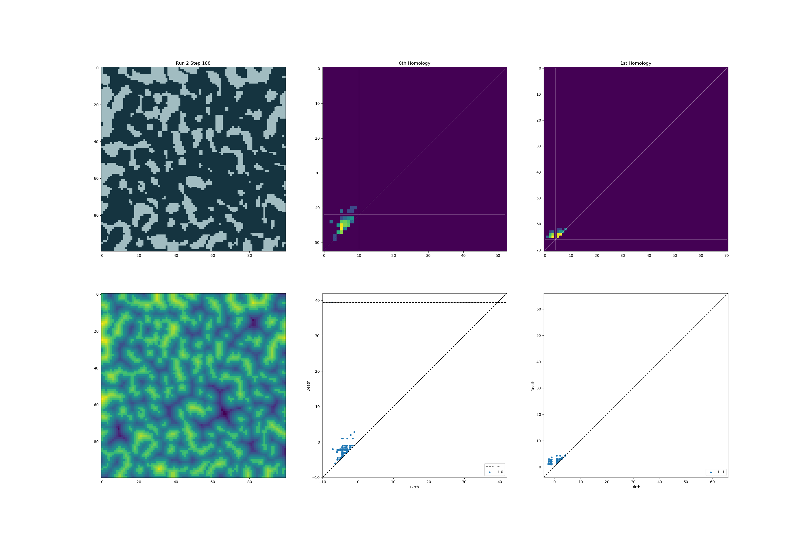

# TDA-for-Sea-Ice-Percolation



Code for upcoming paper 'Topological Data Analysis for Percolation in Arctic Melt Pond Evolution'

Dependencies:
Ripser: a TDA package which computes persistence diagrams - see https://ripser.scikit-tda.org/en/latest/
Persim: Package for plotting persistence diagrams - see https://persim.scikit-tda.org/en/latest/index.html

To install, copy the following into terminal if working with conda:

```
conda install -c conda-forge ripser persim
```

or if working with pip:

```
pip install cython ripser persim
```

Conda should automatically install cython; if using pip we have to specify this.


## Code files:

my_functions.py : helper functions used throughout files

model_binary_to_fractal.py : takes directory containing folders {Run i} of binary images saved as .txt (1=pond, 0=ice), and calculates the signed Euclidean distance transform, persistence diagrams, persistence images calculated by 'binning' (see [[1]](https://agupubs.onlinelibrary.wiley.com/doi/full/10.1029/2019WR025171)) and plots images visualizing these as well as thumbnails to display if you wanted to visualize persistence images with PCA in an interactive data visualization package like Bokeh.

model_binary_to_fractal.py : takes directory containing folders {Run i} of binary images saved as .txt, and calculates PH fractal dimension for them.

model_binary_to_boundary_fractal.py : above, but computes PH fractal dimension of the boundary

## Model Data:
10 runs, each of 200 time steps, are provided for each of the three variations of the dynamical network model.
Model 1: A constant melt rate
Model 2: Ice covered by pond water has a higher melt rate, modelling ice-albedo feedback
Model 3: Same as Model 2, but now with drainage modelled as random events where ponds drain to sea-level

## Tripser:
A c++ programme I made which computes 0th homology lower star filtration persistence diagrams in the same way ripser does, but in addition tracks the pixel coordinates of birth and death events. Future work: This can be easily modified to track instead the birth coordinates of both components when they merge (thus recording a length scale for how far away connected components are connecting).

##
TODO:
Make a proper python wrapper for tripser.cpp - currently data is being piped between python and c++ via temporary files. This means tripser.py and tripse.exe must be in same folder as the programme you call it from.

## References
<a id="1">[1]</a> 
Moon, C., Mitchell, S. A., Heath, J. E., & Andrew, M. (2019). Statistical inference over persistent homology predicts fluid flow in porous media. Water Resources Research, 55, 9592– 9603. https://doi.org/10.1029/2019WR025171

<a id="1">[2]</a>
Tralie et al., (2018). Ripser.py: A Lean Persistent Homology Library for Python. Journal of Open Source Software, 3(29), 925, https://doi.org/10.21105/joss.00925, https://ripser.scikit-tda.org/en/latest/
